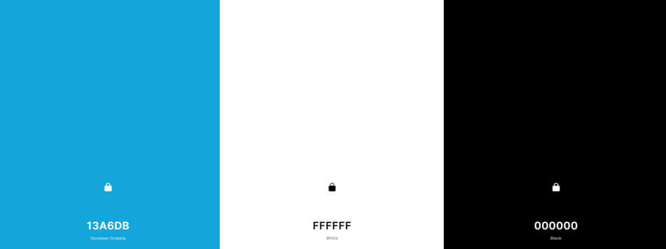

<h1 align="center">Sailing In Space Website</h1>

<h3>Stream One Project - User-Centric Frontend Development</h3>  
 

[View the deployed Sailing In Space Website](https://medusas71.github.io/Sailing-In-Space/)

**Please note: To open any links in this document in a new browser tab, press 'CTRL + Click'.**

<!-- Table of Contents, anchor and the (click to expand or hide) is not my original work. 
It has been sourced from https://gist.github.com/rachelhyman/b1f109155c9dafffe618#real-cool-heading 
and https://github.com/ElectricRCAircraftGuy/AlfaWiFiAdapterSoftware/blob/master/README.md -->

<!-- Nested list spacing is not my original work. It has been sourced from 
https://google.github.io/styleguide/docguide/style.html -->

# Table of Contents

<b>(click to expand or hide)</b>

<!-- MarkdownTOC -->

1. [Description](#description)  
2. [User Experience (UX)](#user-experience-(ux))
   * [User Stories](#user-stories)
   * [5 Planes](#5-planes)
     1. [Strategy](#strategy)  
     2. [Scope](#scope)
     3. [Structure](#structure)
     4. [Skeleton](#skeleton)
     5. [Surface](#surface)
3. [Features](#features)  
    * [Current Features](#current-features)  
    * [Future Features](#future-features)  
4. [Technologies Used](#technologies-used)  
5. [Testing](#testing) 
6. [Lessons Learned](#lessons-learned) 
6. [Deployment](#deployment)  
7. [Credits](#credits)  

<!-- /MarkdownTOC -->

  

# Description  

I am currently studying the Full Stack Development Course through Code Institute. 
Part of the course I am required to complete 4 milestone projects. 
This website is my first milestone project which is part of the User Centric Frontend Module.

This website has been created for local Sunshine Coast Band - Sailing In Space. 
The purpose of this website is for the band to promote gigs, their music and 
merchandise to their fans.  

The final project was submitted early November 2021.

[Back to Table of Contents](#table-of-contents)

# User Experience (UX)

  
## User Stories  

  * Fan Goals - which include potential fans and existing fans  

    * As a fan, I would like to listen to their songs
    * As a fan, I would like to learn about the bands history and the band members
    * As a fan, I would like to follow the band on social media
    * As a fan, I would like to see the band at an upcoming gig
    * As a fan, I would like the opportunity to book the band for a show
    * As a fan, I would like to read the lyrics whilst listening to their songs
    * As a fan, I would like to purchase the bands merchandise
    * As a fan, I would like to see the site on all devices such as phone, tablet and desktop  

  * Site Owner Goals  

    * As a band member of Sailing In Space, I would like to get more gigs
    * As a band member of Sailing In Space, I would like the opportunity for fans to purchase
    tickets to upcoming gigs
    * As a band member of Sailing In Space, I would like to sell merchandise
    * As a band member of Sailing In Space, I would like to increase our social media following
    * As a band member of Sailing In Space, I would like to receive a record deal  
  
  * Record Company Goals  

    * As a record company, I would like to listen to the bands music
    * As a record company, I would like to find out if they already have signed a record deal
    * As a record company, I would like to contact the band 

[Back to Table of Contents](#table-of-contents)

  
## 5 Planes

  
### 1. Strategy  

The purpose of this project is to create a website for Sailing In Space that
showcases their talent to their fans and for a potential record deal.

The site owner goals of this website are:
  * To receive a record deal
  * To get more gigs which include functions and weddings
  * For fans to purchase tickets to upcoming gigs
  * To increase our social media following
  * To sell merchandise

The existing and potential fan goals of this website are:
  * To listen to their music
  * To attend gigs
  * To learn more about the band
  * To purchase merchandise
  * To follow the band on social media
  * To book the band for functions and/or weddings

The record company goals of this website are:
 * To listen to their music
 * Find out if they already have a record deal
 * Contact the band

### 2. Scope  

The features of this project will include:
  * The ability to listen to the bands music
  * The ability to purchase merchandise
  * The ability to learn more about the band
  * The ability to see what gigs they are playing at
  * The ability to contact the band
  * The ability to go straight to social media platforms from the website

### 3. Structure  

The information is grouped logically for all customers. The Interaction Design (IXD) will be consistent
between pages where the navigation bar is fixed and tailored to have the priority items displayed first
at the top of the screen. All social media icons will be in the footer and the footer will be fixed so 
users can access these icons at all times. Once the 'Contact Us' content has been submitted, the user
will have clear feedback that the information has been submitted. The site will be consistent with what
users expect from a band website.

### 4. Skeleton  

The wireframes have been created 3 times using Balsamiq. I originally had too many wireframes so I cut them down after discussion
with my Mentor and they became the 2nd version.

As I was developing the website, I noticed that how I had set out the wireframes wasn't working on a mobile and 
at times the desktop and tablet version needed to be changed as well. This has been included in my Lessons Learned.

Here are the final [wireframes](./documents/sailing-in-space-wireframes.pdf):

* [Home Page Wireframe](./readme-images/wireframes/homepage.png)  
* [The Music Wireframe](./readme-images/wireframes/the-music.png)  
* [Gigs Wireframe](./readme-images/wireframes/gigs.png)  
* [The Band Wireframe](./readme-images/wireframes/the-band.png)  
* [Merchandise Wireframe](./readme-images/wireframes/merchandise.png)  
* [Contact Us Wireframe](./readme-images/wireframes/contact-us.png)  
* [Thank You Wireframe](./readme-images/wireframes/thank-you.png)  
* [404 Error Wireframe](./readme-images/wireframes/404-error.png)  

### 5. Surface  

Colour Scheme  
  * I wanted to use black and white as colours that represented space. The main colour will be black #000 for the background and white #FFF for the text. I used blue #13A6DB (Cerulean Crayola) for the navigation bar, buttons and titles.
    The blue was selected from the logo by using [Image Color Picker](https://imagecolorpicker.com/).  

       
    Colours sourced using [Coolors](https://coolors.co/13a6db-ffffff-000000)  
  * I came up with this selection by firstly checking [WebAIM](https://webaim.org/resources/contrastchecker/) to ensure that the foreground colour of #13A6DB and the background colour #000 were accessible.  
    
    
  * I then wanted a different colour to display when hovering over a link. I used [Color Space](https://mycolor.space/?hex=%2313A6DB&sub=1) and found the yellow #F9F871 (Icterine) in the generic gradient to use as my link colour.  
    
    

  * The final four colours chosen:

  ![Final Colours of Website]./readme-images/final-colours-of-website.JPG)  
  Colours sourced using [Coolors](https://coolors.co/13a6db-f9f871-ffffff-000000)
  
  Typography  
  * The Roboto font is the main font used throughout the whole website with sans-serif as the fallback font.
  This font was chosen as it compliments the Titillium Web font that is used for the titles.  
  * The Titillium Web font was used for all headings with sans-serif as the fallback font.
  This font was chosen as it is a close font to Sailing In Spaces logo.  

  Imagery
  * All images, except the 404 error page, were sourced from Sailing In Space and include images of the band, merchandise and gigs.  
  * The 404 error page was sourced from [Freepik](https://www.freepik.com)  

[Back to Table of Contents](#table-of-contents)

# Features  

**Current Features**   

I have designed the website for the mobile and desktop to have a different look. The reason for this, is due to the
background images that display on a desktop didn't look good on a mobile and were hard to see.

Each page features: 
* A fixed header that contains:  
  * a logo featured on the left hand side that when clicked takes you to the Home Page  
  * a responsive navigation bar that includes 6 links - Home, The Music, Gigs, The Band, Merchandise and Contact Us  
* A fixed footer that contains:
  * an About and Contact Us link on the bottom left hand side
  * copyright information placed in the middle
  * social media icons on the right hand side linking to 6 social media and music pages  

The Home Page features:
* 2 hero images on anything larger than a mobile
* 1 hero image on anything smaller than a tablet
* The introductory text that displays on a mobile is shorter than the desktop version. This does not compromise
the user experience
* A link to the bands new single
* 1 Upcoming Event and a link to further upcoming events that is linked to the Gigs page

The Music Page features: 
* An opaque background image of Jesse and Dylan playing in black and white displays on anything larger than a mobile
* A black background displays on anything smaller than a tablet
* You can play and/or read the lyrics to each of the bands songs
* When any song is played a new tab displays the song in Spotify where the user
has control of when to press the play button
* The lyrics all display in their own modals
* A "read more / read less" button displays as there is too much text to display on the page initially and the user can click the button to read more and click the read less button to shorten the text
* A sneak preview to their new video "Like It" where the user has control of 
when to play the video
* On anything larger than a mobile, the Singles display 1st to the left of the screen, Coming Soon displays in the middle as your eyes are attracted to the middle of the screen and Albums display 3rd on the right of the screen
* On a mobile the order has been switched. The Coming Soon video displays 1st, the Singles displays 2nd and the Albums display 3rd

The Gigs Page features:
* An opaque background image of Jesse and Dylan playing displays on anything larger than a mobile
* A black background displays on anything smaller than a tablet
* A list of all their upcoming events with links to each gig in Facebook
* Information regarding private functions and venue bookings
* Two videos where the band had played at weddings
* A "read more / read less" button displays under "Private Functions and Venue Bookings" as there is too much text to display on the page initially and the user can click the button to read more and click the read less button to shorten the text
* A link to book the band that is linked to the Contact Us page
* The "Book Us Now" link has been duplicated on the page so you can either click the link just under the title or once you have finished looking at the page, you can click the link at the bottom of the screen

The Band Page features:
* A background image of Jesse and Dylan displays on anything larger than a mobile
* A black background displays on anything smaller than a tablet
* A "read more / read less" button displays as there is too much text to display on the page initially and the user can click the button to read more and click the read less button to shorten the text
* A link to a bio on each of the bands members
* On a mobile, a face image displays of both band members with a link to a bio underneath each image
* Each bio displays in its own modal

The Merchandise Page features:
* A link to order merchandise 
* A carousel of the bands merchandise that includes the price of the item
* An image of the back of the shirt worn by Dylan

The Contact Us Page features:
* A form to contact the band about bookings, merchandise, general enquiries and anything else
* Once you click 'submit' on the form, you are taken to a thank you page
* An image of Sailing in Space which only displays on anything larger than a mobile

**Future Features to implement**

* Include Past Events. This will give the audience an idea of how many gigs 
they have done and the venues they play at
* A photo gallery
* A video gallery
* Sell the bands music
* Singles to be a stand-alone page
* Add thumbnail of album cover and link to album page
* Add thumbnail of singles and link to singles page
* A booking calendar so users can book the band and know when the band is available
* SEO Optimised

[Back to Table of Contents](#table-of-contents)

# Technologies Used  

Languages Used  

1. [HTML5](https://en.wikipedia.org/wiki/HTML5)
2. [CSS3](https://en.wikipedia.org/wiki/CSS)

Frameworks, Libraries, Programs and Resources Used  

1. [Am I Responsive](https://www.adobe.com/express/feature/image/resize) - to create a Home Page image on each device for use in the Readme file  
2. [Anna Greaves (portait-artist)](https://github.com/AJGreaves/portrait-artist#readme) - for ideas and information from the Readme file  
3. [Autoprefixer CSS Online](https://autoprefixer.github.io/) - to ensure all vendor prefixes were included in CSS
4. [Balsamiq](https://balsamiq.com/) - wireframes  
5. [Bootstrap 4.6 CDN](https://getbootstrap.com/docs/4.6/getting-started/introduction/) - to make the website responsive  
6. [Code Institute course content](https://learn.codeinstitute.net/login?next=/) - main source of fundamental knowledge  
7. [ColorSpace](https://mycolor.space/) - to generate a colour palette
8. [Commonmark](https://commonmark.org/help/) - markdown language references  
9. [Coolors](https://coolors.co/) - to display colour palettes
10. [Favicon Generator](https://favicon.io/favicon-generator/) - to generate the favicon  
11. [Facebook](https://www.facebook.com/SailingInSpace) - for the images and videos  
12. [Font Awesome](https://fontawesome.com/v5.15/icons?d=gallery&p=2) - for their icons  
13. [Freepik](https://www.freepik.com) - 404 error page  
14. [Gabriel Staples](https://github.com/ElectricRCAircraftGuy/AlfaWiFiAdapterSoftware/blob/master/README.md) - to create a Table of Contents for the Readme and Testing files
15. [Google Fonts](https://fonts.google.com/) - typography  
16. [GitPod](https://www.gitpod.io/) - IDE  
17. [Git](https://git-scm.com/) - version control  
18. [GitHub](https://github.com/) - hosting service  
19. [Image Colour Picker](https://imagecolorpicker.com/) - to select a main colour for navigation bars, buttons and titles
20. [Jim Lynx (Explore Island)](https://github.com/JimLynx/CI-MS1-Explore-Ireland/blob/master/README.md) - for ideas and information from the Readme file 
21. [jQuery](https://jquery.com/) - for the responsive navbar  
22. [Lighthouse](https://developers.google.com/web/tools/lighthouse) to check for any issues on all pages
23. [Markdown Style Guide](https://google.github.io/styleguide/docguide/style.html) - for nested list spacing
24. [PIXLR](https://pixlr.com/x/) - to reverse a photo  
25. [Popper.js](https://popper.js.org/) - for the responsive navbar  
26. [Rachel Hyman](https://gist.github.com/rachelhyman/b1f109155c9dafffe618#real-cool-heading) - to assist with anchor links in the Readme and Testing files
27. [Slack](https://slack.com/) - main source of assistance from other students, developers and documents/resources  
28. [Snagit](https://www.techsmith.com/screen-capture.html) - screen capture and resizing images  
29. [Stack overflow](https://stackoverflow.com/) - for resolving specific issues
30. [TinyPNG](https://tinypng.com/) - efficient compression of images for the site  
31. [W3C CSS Validation Service](https://jigsaw.w3.org/css-validator/) - to ensure there are no errors in the CSS code
32. [W3C Markup Validation Service](https://validator.w3.org/#validate_by_input) - to ensure there are no errors in the HTML code
33. [W3Schools](https://www.w3schools.com/) - to assist with code
34. [Wave](https://wave.webaim.org/) - to ensure the content was accessible
35. [WebAIM](https://webaim.org/resources/contrastchecker/) - web accessibility contrast checker

[Back to Table of Contents](#table-of-contents)

# Testing  

[See Testing.md for testing information](TESTING.md)

[Back to Table of Contents](#table-of-contents)  

  
# Lessons Learned  

* Don't try and do the whole website at once
  * other features can be added later  
  * check for scope creep  
* How to word commit messages and format them  
  * You don't need one huge line of text  
  * You can break the commit messages into different lines  
* Take regular breaks  
* You know more than you give yourself credit for  
* Only go by videos that you have watched throughout the course  
  * For example, only use Bootstrap 4 as Bootstrap 5 is not supported by Code Institute  
* There is so much to learn  
  * It takes time to introduce new features, it isn't as simple as copying and pasting code from Bootstrap and other sources
* Don't forget to commit after an introduction of an item. I get too excited learning and playing that I forget to commit regularly
* I need to take more time with my wireframes so I am not changing them after starting the website. This was the first time
I had ever created wireframes and realised that what works on a desktop does not always work on a mobile or tablet. I did change some 
of the desktop wireframes too from the original wireframes as I now know what works well on a page

[Back to Table of Contents](#table-of-contents)

# Deployment  

The code for this website was written in [Gitpod](https://www.gitpod.io/) and pushed to GitHub Pages from its [GitHub repository](https://github.com/Medusas71/Sailing-In-Space) using Chrome browser.

The following process was used to deploy this website:

* In the [GitHub repository](https://github.com/Medusas71/Sailing-In-Space) click [Settings](https://github.com/Medusas71/Sailing-In-Space/settings)
* Select 'Pages' from the menu on the left hand side
* [GitHub Pages](https://github.com/Medusas71/Sailing-In-Space/settings/pages) displays
* Under 'Source', click 'Branch' and select 'Main'
* Click 'Save'
* A URL displays advising that you site has been published
* Use this URL for your live website

Each time the code is pushed from Gitpod to GitHub, the deployed site is automatically published.

**Run this site locally**

You can clone this repository directly into an editor of your choice and run the site locally.

To do this:

* From the [GitHub repository](https://github.com/Medusas71/Sailing-In-Space) which is on the 'Code' heading page
* Click the dropdown 'Code' button which is next to the green Gitpod button
* You can either copy the link into your own IDE or 'Download Zip' which can be unzipped on your local machine

Please Note: That if you are wanting to use Gitpod as your IDE you will need to install the [Gitpod Browser Extentions for Chrome](https://www.gitpod.io/docs/browser-extension/). After installation, restart the browser.

[Back to Table of Contents](#table-of-contents)

# Credits  

Code  

* Dave Horrocks, Code Institute student for his assistance in helping me understand some code  
and for showing me a new way to do the commits so it isn't all on 1 line  
* SuzyBee, Code Institute student for her assistance in helping me understand some code  
* Tutor Support for assistance in helping me understand some code  
* My mentor for all his support
* [W3Schools](https://www.w3schools.com/) for assistance with code  
* [Responsive CSS Aspect Ratio](https://blog.webdevsimplified.com/2020-12/responsive-css-video/) for how to make the videos responsive  
* [Stack Overflow](https://stackoverflow.com/) for resolving specific issues
* See Bugs/Fixes in the [TESTING.md](TESTING.md) for specific credits for code fixes

Content  
* All content was courtesy of Sailing In Space  
* The text for the Home Page was created by [JJJ Unearthed](https://www.triplejunearthed.com/artist/sailing-space.html)  

Media 
* All images are courtesy of Sailing In Space except for the 404 error page
* 404 error page courtesy of Business Vector created by pikisuperstar - [www.freepik.com](https://www.freepik.com/free-vector/error-404-concept-landing-page_4730712.htm#page=1&query=404&position=4)   

Readme
* Table of Contents, anchors and the (click to expand or hide) has been sourced from:  
  * [Rachel Hyman](https://gist.github.com/rachelhyman/b1f109155c9dafffe618#real-cool-heading) and
  * [Gabriel Staples ElectricRCAircraftGuy](https://github.com/ElectricRCAircraftGuy/AlfaWiFiAdapterSoftware/blob/master/README.md#wiki-instructions)  
* Nested list spacing has been sourced from:  
  * [Markdown Style Guide](https://google.github.io/styleguide/docguide/style.html)

Acknowledgements
* Sailing In Space, my family and friends for their input and support

[Back to Table of Contents](#table-of-contents)