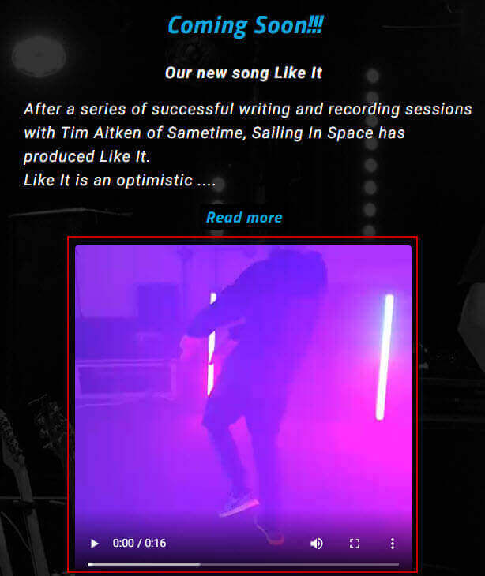
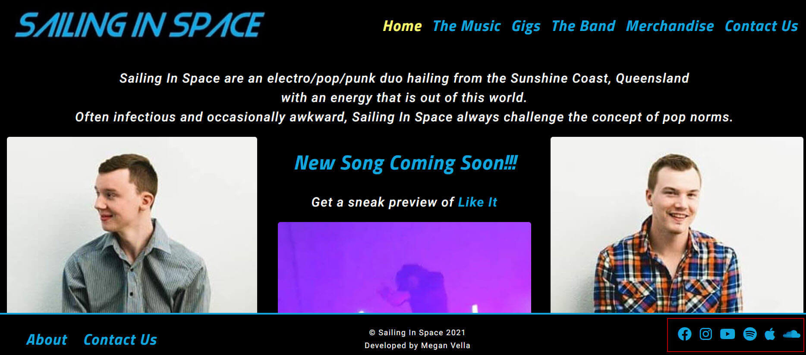
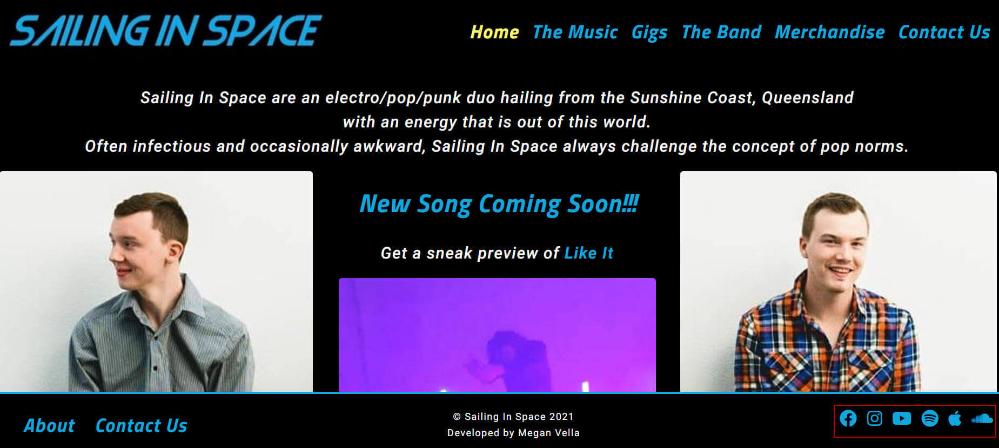
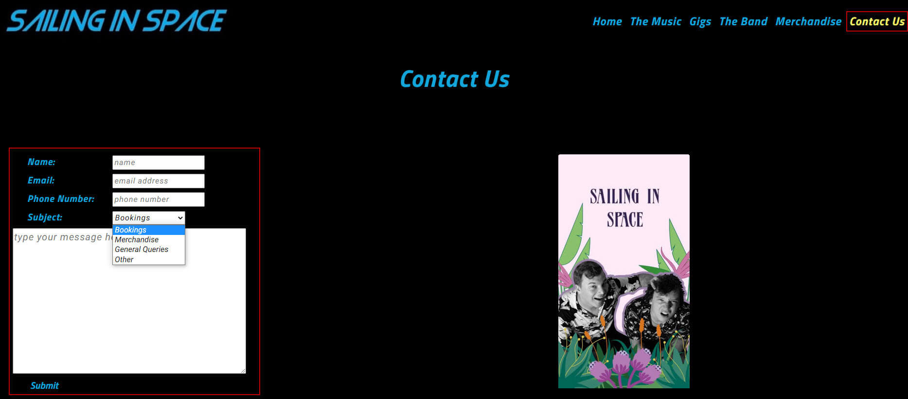

<h1 align="center">Sailing In Space Website - Testing Details</h1>

[View the main README.md document](README.md)

[View the deployed Sailing In Space Website](https://medusas71.github.io/Sailing-In-Space/)

**Please note: To open any links in this document in a new browser tab, press 'CTRL + Click'.**

# Table of Contents

<b>(click to expand or hide)</b>

<!-- MarkdownTOC -->

[Testing](#testing)
* [Validators](#validators)
* [Lighthouse](#lighthouse)
* [User Stories](#user-stories)

<!-- /MarkdownTOC -->

# Testing 

Testing was conducted manually and through different validator services on each page of the website.

## Validators

* [W3C Markup Validation Service](https://validator.w3.org/#validate_by_input) was used on each page to ensure that there were no errors or warnings in my HTML document and was validated by direct input. I had no errors or warnings on any page:  

* [W3C CSS Validation Service](https://jigsaw.w3.org/css-validator/) was used to ensure that there were no errors or warnings in my CSS document and was validated by direct input. I had no errors or warnings display:

  

* [Autoprefixer CSS Online](https://autoprefixer.github.io/) was used to ensure that all vendor prefixes were included in CSS. The results were copied into the style.css file  

[Back to Table of Contents](#table-of-contents)

## Lighthouse

* [Lighthouse](https://developers.google.com/web/tools/lighthouse) was used to check for any problems on all pages. Some of the issues, like accessibility, I have resolved to improve the score. The remaining issues will be researched to improve the score as I learn.
Here is the lighthouse score for each page on mobile and desktop:

### index.html - mobile  

### index.html - desktop  

  

### the-music.html - mobile

  

### the-music.html - desktop
  

### gigs.html - mobile

  

### gigs.html - desktop

  

### the-band.html - mobile

  

### the-band.html - desktop

  

### merchandise.html - mobile

 

### merchandise.html - desktop

 

### contact-us.html - mobile

 

### contact-us.html - desktop

 

### thank-you.html - mobile

 

### thank-you.html - desktop

 

[Back to Table of Contents](#table-of-contents)

## User Stories  

### Testing User Stories from the UX section of the [README](/SAILING-IN-SPACE/README.md/)  

### Fan Goals

1.  As a fan and a record company, I would like to listen to the bands songs:
    * This is achieved by clicking "The Music" navigation link at the top of each page in the fixed header. Once on "The Music" page, you can click the "Play" button next to each song. The song displays using Spotify in a new tab and it is up to the user to click play on the song. The users can also hear a snippet of the bands new upcoming single on "The Music" page.
    
&nbsp;

  
    

2.  As a fan, I would like to learn about the bands history and the band members:
    * This is achieved by clicking "The Band" navigation link at the top of each page in the fixed header and the "About" navigation link in the fixed footer on every page. A snippet of information regarding the band is displayed on "the Band" page and there is a link to read more about the band. There is also a link against each band member that displays a modal with their bio included.
    
&nbsp;

3.  As a fan, I would like to follow the band on social media:
    * This is achieved by clicking the social media links that are in the fixed footer on every page.
    
&nbsp;
 

4.  As a fan, I would like to see the band at an upcoming gig:
    * This is achieved by viewing the "Upcoming Events" on the "Home Page - index.html" and clicking the "See more upcoming events" link. The user is taken to the "Gigs" page where they can see what events are upcoming.
    * This is also achieved by clicking the "Gigs" navigation link at the top of each page in the fixed header and viewing all upcoming events.
    
&nbsp;

5.  As a fan, I would like the opportunity to book the band for a show:
    * This is achieved by clicking the "Contact Us" link in the fixed header and footer of every page and requesting a booking.
    * You can also click the "Book Us Now" link on the "Gigs" page that forwards you to the "Contact Us" page. 
    
&nbsp;
  

6.  As a fan, I would like to read the lyrics whilst listening to their songs:
    * This is achieved by clicking "The Music" navigation link in the fixed header at the top of every page. On the page you can click "Play" next to a song and Spotify opens in a new tab. You can press play and then go back to the website and click "Lyrics" next to the song. The lyrics display in a modal.
    
&nbsp;
  

7.  As a fan, I would like to view and possibly purchase the bands merchandise:
    * The merchandise can be viewed by clicking the "Merchandise" navigation link at the top of each page in the fixed header. The merchandise can be purchased by using the "Contact Us" form.
    
&nbsp;
  

8.  As a fan, I would like to see the site on all devices such as phone, tablet, laptop and desktop:
    * This is achieved by making the website responsive for all devices.
    
&nbsp;
  

### Site Owner Goals

9.  As a band member of Sailing In Space, I would like to get more gigs:
    * This is achieved by:
        * displaying upcoming events on the "Home" page to promote what they are currently doing;
        * a link on the home page to "See more upcoming events" to promote what they are currently doing;
        * displaying upcoming events on the "Gigs" page to promote what they are currently doing;
        * displaying videos of the band performing on the "Gigs" page to promote what they have done previously;
        * having a contact form on the "Contact Us" page.
    
&nbsp;
  

10. As a band member of Sailing In Space, I would like the opportunity for fans to purchase tickets to upcoming gigs:
    * The upcoming events displayed on the "Home" and "Gigs" page have links to the event where tickets can be purchased directly from the event via Facebook.
    
&nbsp;
  

11. As a band member of Sailing In Space, I would like to sell merchandise:
    * This is achieved by viewing all merchandise on "The Band" page and by using the contact form on the "Contact Us" page to purchase the merchandise.
    
&nbsp;
  

12. As a band member of Sailing In Space, I would like to increase our social media following:
    * This is achieved by having all social media links displayed on the fixed footer that is on each page.
    
&nbsp;
  

13. As a band member of Sailing In Space, I would like to receive a record deal:
    * This can potentially be achieved by promoting their music on "The Music" page and their gigs on "The Band" page.
    * Also, it is noted on the "Band" page that the band is looking for a record deal.
    
&nbsp;
  

### Record Company Goals

14. As a record company, I would like to find out if they already have signed a record deal:
    * The information on "The Band" page advises that the band is looking for a record deal.
    
&nbsp;

15. As a record company, I would like to contact the band:
    * This is achieved by having a contact form on the "Contact Us" page.

[Back to Table of Contents](#table-of-contents)

## Manual testing of all elements and functionality on every page

### Browsers tested:
*   Google Chrome
*   Mozilla Firefox
*   Microsoft EDGE
*   Opera
*   Safari

### Devices tested:
*   iPhone 12
*   iPhone 11
*   iPhone 8 Plus
*   laptop
*   desktop 

|Page   | Section | Action | Expected Behaviour | Result |
| ----- | ------- | ------ | ------------------ | ------ |
| Home Page | Tab at top of page | On a desktop, go to https://medusas71.github.io/Sailing-In-Space | The Home Page displays; The favicon displays in the tab; the tab is named "Home Sailing In Space" | P/F |
|       | Background | The background is black | The background is black | 
|       | Header | Scroll to ensure the header is fixed | The header is fixed |
| | Logo | Confirm the logo displays | The logo displays | 
|       |         | Confirm that you can click the logo and verify the Home Page displays | The Home Page displays |   |
|       | Navigation Bar |Confirm 5 navigation links display, which includes The Music, Gigs, The Band, Merchandise, Contact Us | The 5 links display |
|       |         | Hover over the 5 navigation links stated above to ensure that they change colour to yellow | All links change colour to yellow once hovered |
|       |         | Click each navigation link | The correct corresponding page displays and the navigation link stays yellow to state you are on that particular page |
|       | Page Section | Confirm the hero image of Jesse displays on the left of the screen | Jesse displays on the left of the screen| 
|       |         | A blurb about Sailing In Space displays at the top of the screen | A blurb displays | 
|       |         | The New Song Coming Soon information displays in the middle of the screen | Information regarding the new song displays | 
|       |         | You can hover over the words "Like It" and the text turns yellow | The text turns yellow on hover |
|       |         | You can click the words "Like It" and "The Music" page displays | "The Music" page displays | 
|       |         | You can click the "Like It image" and "The Music" page displays | "The Music" page displays |
|       |         | A hero image of Dylan displays on the right of the screen | An image of Dylan displays on the right of the screen |
|       |         | Under the "Like It image" there is an upcoming event | There is a title called "Upcoming Events"; there is a date of the event; there is an image of the event; there is a link regarding "see more upcoming events" |
|       |         | Click the "Upcoming event image" | The upcoming event page displays in Facebook |
|       |         | Click the link "see more upcoming events" | The "Gigs" page displays | 
|       |         | Hover over each image and confirm the alt text displays | The alt text displays on all images | 
|       | Footer | Scroll to ensure the footer is fixed | The footer is fixed | 
|       |         | Confirm there are two links on the left hand side called "About" and "Contact Us" | There are two links named "About" and "Contact Us" |
|       |         | Hover over the two links stated above to ensure that they change colour to yellow | Both links change colour to yellow once hovered |
|       |         | Click the "About" link | You are taken to "The Band" page |
|       |         | Click the "Contact Us" link | You are taken to the "Contact Us" page |
|       |         | Confirm the "copywright" information and the "developed by" information displays in the middle of the footer | Copywright and developed by information displays in the middle of the footer |
|       |         | Confirm there are 6 icons in the bottom right of the footer, which includes Facebook, Instagram, YouTube, Spotify, Apple Music, SoundCloud | The correct 6 icons display | 
|       |         | Hover over the 6 icons stated above to ensure that they change colour to yellow | All icons change colour to yellow once hovered | 
|       |         | Click each icon | The correct corresponding page displays in a new tab | 
|       | Responsiveness | Go to Dev Tools and confirm the page displays correctly when you reduce and expand the margins | At 991px the hamburger menu displays; At 767px the SIS Bio reduces in text, and the 2 separate images come together to make one image, underneath is the "New Song Coming Soon" text and image, and lastly the Upcoming Events display; At 576px the footer is placed into 3 rows vertically; As you scroll down the page on any size, the header and footer are fixed. | 
| The Music Page | Tab at top of page | On a desktop, go to https://medusas71.github.io/Sailing-In-Space/the-music.html | The Music Page displays; The favicon displays in the tab; the tab is named "Music Sailing In Space" | P/F | 
|       | Background | The background is an opaque image of the boys performing | The background is an opaque image of the boys performing | 
|       | Header | Scroll to ensure the header is fixed | The header is fixed |
| | Logo | Confirm the logo displays | The logo displays | 
|       |         | Confirm that you can click the logo and verify the Home Page displays | The Home Page displays |   |
|       | Navigation Bar |Confirm 5 navigation links display, which includes The Music (which displays in yellow), Gigs, The Band, Merchandise, Contact Us | The 5 links display |
|       |         | Hover over the blue navigation links stated above to ensure that they change colour to yellow | All links change colour to yellow once hovered |
|       |         | Click each navigation link | The correct corresponding page displays and the navigation link stays yellow to state you are on that particular page |
|       | Page Section | The title "The Music" displays in the centre of the screen | The title "The Music" displays | 
|       |         | 3 columns display underneath the title | Singles, Coming Soon and Albums | 
|       |         | Against each song in the Singles and Albums the words "Play" and "Lyrics" display and when hovered over the text changes colour | The words "Play" and "Lyrics" display next to each song title and the text changes colour from blue to yellow |
|       |         | Against each song in the Singles and Albums you can click "Play" and "Lyrics" | Play and Lyrics display next to each song title; once "Play" is clicked the song displays on Spotify in a new tab, where the user can select to press play and hear the song; On the original tab once "Lyrics" is clicked the lyrics of the song displays on a modal |
|       |         | On each modal, you can either click the close button or click elsewhere on the screen for the modal to close | The modal closes when clicking the close button or clicking elsewhere on the screen |
|       |         | The Coming Soon information displays in the middle of the screen | Information regarding the new song displays | 
|       |         | There is a "Read more" button underneath part of the text that displays yellow when hovered over | The button displays and the text turns yellow on hover | 
|       |         | When "Read more" is clicked, the remaining parts of the text about the new song display | The rest of the text displays and the button changes from "Read more" to "Read Less" | 
|       |         | When hovering over the "Read less" button, the text changes colour; Once you click "Read less" the overflow of text disappears | The "Read less" button changes text colour from blue to yellow; once clicked the overflow of text disappears |
|       |         | Under the button the Like It video displays; The video does not autoplay; Click play and the video plays, click pause and the video pauses, click the sound button and the video mutes, there is an option to open in full screen and to close the full screen once opened | The button displays; the video does not autoplay, the video plays, the video pauses, the video mutes and you can open the video in full screen and close the full screen | 
|       | Footer | Scroll to ensure the footer is fixed | The footer is fixed | 
|       |         | Confirm there are two links on the left hand side called "About" and "Contact Us" | There are two links named "About" and "Contact Us" |
|       |         | Hover over the two links stated above to ensure that they change colour to yellow | Both links change colour to yellow once hovered | 
|       |         | Click the "About" link | You are taken to "The Band" page |
|       |         | Click the "Contact Us" link | You are taken to the "Contact Us" page | 
|       |         | Confirm the "copywright" information and the "developed by" information displays in the middle of the footer | Copywright and developed by information displays in the middle of the footer |
|       |         | Confirm there are 6 icons in the bottom right of the footer, which includes Facebook, Instagram, YouTube, Spotify, Apple Music, SoundCloud | The correct 6 icons display | 
|       |         | Hover over the 6 icons stated above to ensure that they change colour to yellow | All icons change colour to yellow once hovered | 
|       |         | Click each icon | The correct corresponding page displays in a new tab | 
|       | Responsiveness | Go to Dev Tools and confirm the page displays correctly when you reduce and expand the margins | At 991px the hamburger menu displays; At 767px the background image is removed and the background colour is black; the content displays vertically with Coming Soon at the top, Singles in the middle and Albums displayed last; At 576px the footer is placed into 3 rows vertically; As you scroll down the page on any size, the header and footer are fixed. | 
| The Gigs Page | Tab at top of page | On a desktop, go to https://medusas71.github.io/Sailing-In-Space/gigs.html | The Gigs Page displays; The favicon displays in the tab; the tab is named "Gigs Sailing In Space" | P/F | 
|       | Background | The background is an image of the boys performing | The background is an image of the boys performing | 
|       | Header | Scroll to ensure the header is fixed | The header is fixed |
| | Logo | Confirm the logo displays | The logo displays | 
|       |         | Confirm that you can click the logo and verify the Home Page displays | The Home Page displays |   |
|       | Navigation Bar |Confirm 5 navigation links display, which includes The Music, Gigs (which displays in yellow), The Band, Merchandise, Contact Us | The 5 links display and the Gigs link displays in Yellow | 
|       |         | Hover over the blue navigation links stated above to ensure that they change colour to yellow | All links change colour to yellow once hovered |
|       |         | Click each navigation link | The correct corresponding page displays and the navigation link stays yellow to state you are on that particular page | 
|       | Page Section | The title "Gigs" displays in the centre of the screen | The title "Gigs" displays | 
|       |         | The title "Upcoming Events" displays under "Gigs" | The title "Upcoming Events" displays | 
|       |         | 2 columns display underneath the titles | two upcoming events display with date, venue, time, information and image of event | 
|       |         | The word "Facebook" is in blue and changes colour when you hover over the word | The word "Facebook" changes from blue to yellow when hovered over |
|       |         | When you click either the "Facebook" link or the upcoming event image, a new tab displays the event via Facebook | A new tab displays the event via Facebook |
|       |         | Below the events, the title "Book Us Now" displays and when hovered over the colour changes. When clicked the "Contact Us" page displays | The words "Book Us Now" display next to each song title and the text changes colour from blue to yellow when hovered over |
|       |         | On the next line there is a Private Functions and Venue Bookings heading display with a blurb about booking the band | The title of Private Functions and Venue Bookings display with a blurb underneath |
|       |         | There is a "Read more" button underneath part of the text that displays yellow when hovered over | The button displays and the text turns yellow on hover | 
|       |         | When "Read more" is clicked, the remaining parts of the text about the new song display | The rest of the text displays and the button changes from "Read more" to "Read Less" | 
|       |         | When hovering over the "Read less" button, the text changes colour; Once you click "Read less" the overflow of text disappears | The "Read less" button changes text colour from blue to yellow; once clicked the overflow of text disappears |
|       |         | Under the button two wedding videos display; The videos do not autoplay; Click play and the video plays and there is an option to open in full screen | The button displays; the videos do not autoplay and you can open each video in full screen | 
|       | Footer | Scroll to ensure the footer is fixed | The footer is fixed | 
|       |         | Confirm there are two links on the left hand side called "About" and "Contact Us" | There are two links named "About" and "Contact Us" |
|       |         | Hover over the two links stated above to ensure that they change colour to yellow | Both links change colour to yellow once hovered | 
|       |         | Click the "About" link | You are taken to "The Band" page |
|       |         | Click the "Contact Us" link | You are taken to the "Contact Us" page |
|       |         | Confirm the "copywright" information and the "developed by" information displays in the middle of the footer | Copywright and developed by information displays in the middle of the footer |
|       |         | Confirm there are 6 icons in the bottom right of the footer, which includes Facebook, Instagram, YouTube, Spotify, Apple Music, SoundCloud | The correct 6 icons display | 
|       |         | Hover over the 6 icons stated above to ensure that they change colour to yellow | All icons change colour to yellow once hovered | 
|       |         | Click each icon | The correct corresponding page displays in a new tab | 
|       | Responsiveness | Go to Dev Tools and confirm the page displays correctly when you reduce and expand the margins | At 991px the hamburger menu displays; At 767px the background image is removed and the background colour is black; the content displays vertically with Gigs and Upcoming Events at the top, Book Us Now in the middle and Private Functions and Venue Bookings displayed last; At 576px the footer is placed into 3 rows vertically; As you scroll down the page on any size, the header and footer are fixed. | 
| The Band Page | Tab at top of page | On a desktop, go to https://medusas71.github.io/Sailing-In-Space/the-band.html | The Band Page displays; The favicon displays in the tab; the tab is named "The Band Sailing In Space" | P/F | 
|       | Background | The background is an image of the boys sitting down | The background is an image of the boys sitting down facing each other | 
|       | Header | Scroll to ensure the header is fixed | The header is fixed |
| | Logo | Confirm the logo displays | The logo displays | 
|       |         | Confirm that you can click the logo and verify the Home Page displays | The Home Page displays |   |
|       | Navigation Bar |Confirm 5 navigation links display, which includes The Music, Gigs, The Band (which displays in yellow), Merchandise, Contact Us | The 5 links display and The Band link displays in Yellow | 
|       |         | Hover over the blue navigation links stated above to ensure that they change colour to yellow | All links change colour to yellow once hovered over |
|       |         | Click each navigation link | The correct corresponding page displays and the navigation link stays yellow to state you are on that particular page | 
|       | Page Section | The title "The Band" displays in the centre of the screen | The title "The Band" displays | 
|       |         | Under the title there is part of a spiel about how the band was formed | Part of a speil displays | 
|       |         | There is a "Read more" button underneath part of the text that displays yellow when hovered over | The button displays and the text turns yellow on hover | 
|       |         | When "Read more" is clicked, the remaining parts of the text about the band display | The rest of the text displays and the button changes from "Read more" to "Read Less" | 
|       |         | When hovering over the "Read less" button, the text changes colour; Once you click "Read less" the overflow of text disappears | The "Read less" button changes text colour from blue to yellow; once clicked the overflow of text disappears |
|       |         | Under the button to the left of the screen is Jesse's title and a link to his bio in blue; when you hover over the link it changes colour | The words "Jesse Bio" display in blue and change colour to yellow upon hover | 
|       |         | Under the button to the right of the screen is Dylan's title and a link to his bio in blue; when you hover over the link it changes colour | The words "Dylan Bio" display in blue and change colour to yellow upon hover | 
|       | Footer | Scroll to ensure the footer is fixed | The footer is fixed | 
|       |         | Confirm there are two links on the left hand side called "About" and "Contact Us" | There are two links named "About" and "Contact Us" |
|       |         | Hover over the two links stated above to ensure that they change colour to yellow | Both links change colour to yellow once hovered | 
|       |         | Click the "About" link | You are taken to "The Band" page |
|       |         | Click the "Contact Us" link | You are taken to the "Contact Us" page | 
|       |         | Confirm the "copywright" information and the "developed by" information displays in the middle of the footer | Copywright and developed by information displays in the middle of the footer |
|       |         | Confirm there are 6 icons in the bottom right of the footer, which includes Facebook, Instagram, YouTube, Spotify, Apple Music, SoundCloud | The correct 6 icons display | 
|       |         | Hover over the 6 icons stated above to ensure that they change colour to yellow | All icons change colour to yellow once hovered | 
|       |         | Click each icon | The correct corresponding page displays in a new tab | 
|       | Responsiveness | Go to Dev Tools and confirm the page displays correctly when you reduce and expand the margins | At 991px the hamburger menu displays; At 767px the background image is removed and the background colour is black; the content displays vertically with Gigs and Upcoming Events at the top, Book Us Now in the middle and Private Functions and Venue Bookings displayed last; At 576px the footer is placed into 3 rows vertically; As you scroll down the page on any size, the header and footer are fixed. | 
| The Merchandise Page | Tab at top of page | On a desktop, go to https://medusas71.github.io/Sailing-In-Space/merchandise.html | The Merchandise Page displays; The favicon displays in the tab; the tab is named "Merchandise Sailing In Space" | P/F | 
|       | Background | The background is black | The background is black | 
|       | Header | Scroll to ensure the header is fixed | The header is fixed |
| | Logo | Confirm the logo displays | The logo displays | 
|       |         | Confirm that you can click the logo and verify the Home Page displays | The Home Page displays |   |
|       | Navigation Bar |Confirm 5 navigation links display, which includes The Music, Gigs, The Band, Merchandise (which displays in yellow), Contact Us | The 5 links display and the Merchandise link displays in Yellow | 
|       |         | Hover over the blue navigation links stated above to ensure that they change colour to yellow | All links change colour to yellow once hovered over |
|       |         | Click each navigation link | The correct corresponding page displays and the navigation link stays yellow to state you are on that particular page | 
|       | Page Section | The title "Merchandise" displays in the centre of the screen | The title "Merchandise" displays | 
|       |         | Under the title there is line of text and the words "Contact Us" are displayed in blue and change colour when hovered over | A line of text displays and the words "Contact Us" display in blue and change colour to yellow when hovered over | 
|       |         | Click the words "Contact Us" and the "Contact Us" page displays | The "Contact Us" page displays | 
|       |         | To the left of the screen a carousel displays with 5 different images with text and prices on each image | 5 different images display in a carousel with text and prices on each image | 
|       |         | To the right of the screen an image displays of the back of the Sailing In Space shirt worn by Dylan | Image displays of the back of the Sailing In Space shirt worn by Dylan | 
|       | Footer | Scroll to ensure the footer is fixed | The footer is fixed | 
|       |         | Confirm there are two links on the left hand side called "About" and "Contact Us" | There are two links named "About" and "Contact Us" |
|       |         | Hover over the two links stated above to ensure that they change colour to yellow | Both links change colour to yellow once hovered | 
|       |         | Click the "About" link | You are taken to "The Band" page |
|       |         | Click the "Contact Us" link | You are taken to the "Contact Us" page | 
|       |         | Confirm the "copywright" information and the "developed by" information displays in the middle of the footer | Copywright and developed by information displays in the middle of the footer |
|       |         | Confirm there are 6 icons in the bottom right of the footer, which includes Facebook, Instagram, YouTube, Spotify, Apple Music, SoundCloud | The correct 6 icons display | 
|       |         | Hover over the 6 icons stated above to ensure that they change colour to yellow | All icons change colour to yellow once hovered | 
|       |         | Click each icon | The correct corresponding page displays in a new tab | 
|       | Responsiveness | Go to Dev Tools and confirm the page displays correctly when you reduce and expand the margins | At 991px the hamburger menu displays; At 767px the content displays vertically with Merchandise at the top, the carousel in the middle and the image of the back of the shirt worn by Dylan displayed last; At 576px the footer is placed into 3 rows vertically; As you scroll down the page on any size, the header and footer are fixed. | 
| The Contact Us Page | Tab at top of page | On a desktop, go to https://medusas71.github.io/Sailing-In-Space/contact-us.html | The Merchandise Page displays; The favicon displays in the tab; the tab is named "Contact Us Sailing In Space" | P/F | 
|       | Background | The background is black | The background is black | 
|       | Header | Scroll to ensure the header is fixed | The header is fixed |
| | Logo | Confirm the logo displays | The logo displays | 
|       |         | Confirm that you can click the logo and verify the Home Page displays | The Home Page displays |   |
|       | Navigation Bar |Confirm 5 navigation links display, which includes The Music, Gigs, The Band, Merchandise, Contact Us (which displays in yellow) | The 5 links display and the Contact Us link displays in Yellow | 
|       |         | Hover over the blue navigation links stated above to ensure that they change colour to yellow | All links change colour to yellow once hovered over |
|       |         | Click each navigation link | The correct corresponding page displays and the navigation link stays yellow to state you are on that particular page | 
|       | Page Section | The title "Contact Us" displays in the centre of the screen | The title "Contact Us" displays | 
|       |         | To the left of the screen a form displays asking for Name, Email, Phone Number, Subject (with a dropdown menu), an area to type your message and a blue text Submit button that changes colour when hovered over | The words and text boxes display for Name, Email, Phone Number, Subject that has a dropdown menu consisting of Bookings, Merchandise, General Queries and Other, a text box to type your message and the submit button text is in blue and changes colour to yellow when hovered over | 
|       |         | Click the "Submit" button without entering any text | An error message displays that the field must be filled in as it is a required field |
|       |         | Enter an invalid email address without the @ symbol | An error message displays that the @ symbol is missing from the email address |
|       |         | Enter all fields except for a phone number | An error message displays that the field must be filled in as it is a required field |
|       |         | Click the dropdown menu on Subject and confirm that you can select a different subject | Bookings, Merchandise, General Queries and Other could be selected | 
|       |         | Enter all fields and click the "Submit" button | A Thank You page displays advising the user that their enquiry has been submitted, that Sailing In Space will get back to the user as soon as possible and to have a wonderful day, with a rocket emoji |
|       |         | To the right of the screen an image display of Sailing In Space | an image of Sailing In Space displays | 
|       | Footer | Scroll to ensure the footer is fixed | The footer is fixed | 
|       |         | Confirm there are two links on the left hand side called "About" and "Contact Us" | There are two links named "About" and "Contact Us" |
|       |         | Hover over the two links stated above to ensure that they change colour to yellow | Both links change colour to yellow once hovered | 
|       |         | Click the "About" link | You are taken to "The Band" page |
|       |         | Click the "Contact Us" link | You are taken to the "Contact Us" page | 
|       |         | Confirm the "copywright" information and the "developed by" information displays in the middle of the footer | Copywright and developed by information displays in the middle of the footer |
|       |         | Confirm there are 6 icons in the bottom right of the footer, which includes Facebook, Instagram, YouTube, Spotify, Apple Music, SoundCloud | The correct 6 icons display | 
|       |         | Hover over the 6 icons stated above to ensure that they change colour to yellow | All icons change colour to yellow once hovered | 
|       |         | Click each icon | The correct corresponding page displays in a new tab | 
|       | Responsiveness | Go to Dev Tools and confirm the page displays correctly when you reduce and expand the margins | At 991px the hamburger menu displays; At 767px the content displays vertically with Contact Us at the top, the form in the middle and the image of Sailing In Space displayed last; At 576px the footer is placed into 3 rows vertically; As you scroll down the page on any size, the header and footer are fixed. | 

[Back to Table of Contents](#table-of-contents)

# Bugs/Fixes

**Home Page - index.html**

**1.    Issue**:  
    On the home page, I had issues where the images weren't displaying on top of each other on a mobile view. 
* **Fix**: To rectify this, I made my images responsive and that fixed the issue.  

**2.    Issue**:  
    I initially created the video using the video tag in HTML but found the video was taking over the whole screen and wasn't responsive. I changed the video tag to an iframe and this fixed the problem. However the video was set to autoplay on a desktop, which I didn't want to happen. 
* **Fix**: I reverted back to using the video tag and made it responsive by using height: auto and width: 100%.  

**3.    Issue**:  
    The 2nd event wasn't fully displaying on mobile phones. 
* **Fix**: To rectify this I added some media queries specifically for screens with a max-width of 576px. 

**4.    Issue**:  
    I originally had the background image URL on the music page in the HTML instead of the CSS. I was advised by some of the slack students that it was better if I have the URL in the CSS. I tried to put it in the CSS but I was having lots of issues having the image displayed as I wanted it. I spoke to Tutor Support and they advised that there is nothing wrong with having the URL and a huge negative margin to display the text on top of the image.
* **Fix**: I placed the URL for the background image on the music page back in the HTML and I was able to display the image perfectly.  

**Merchandise Page merchandise.html**

**1.    Issue**: 
    I was interested in adding a carousel to the merchandise page. I copied the code from Bootstrap, however whenever I would click the arrow on the carousel, the carousel would change size and get larger.  
* **Fix**: I found the same question asked on [stack overflow](https://stackoverflow.com/questions/49844515/how-do-i-stop-my-bootstrap-carousel-from-changing-size) and found a resolution to the issue by adding an overflow to the css.  

**2.    Issue**;
    On the carousel the text wouldn't display on the first 2 images, but will display on the 3rd image.  
* **Fix**: I had a look on Slack and found this article by [Des Cahill](https://slack-files.com/T0L30B202-F8BFVUW8K-afa2370dff) that I copied and modified accordingly. I could then view the text on the carousel and was able to move the text position.  

**Contact Us Page contact-us.html**

**1.    Issue**;
    When conducting a [Wave Report](https://wave.webaim.org/) on the page, I was advised that a label was missing on the text area part of the form.  
* **Fix**: I found the same question asked on [stack overflow](https://stackoverflow.com/questions/38142464/web-accessibility-failing-on-missing-form-label) and found a resolution in how to add the missing label to the text area part of the form. I added aria-label in the text area.

[Back to Table of Contents](#table-of-contents)