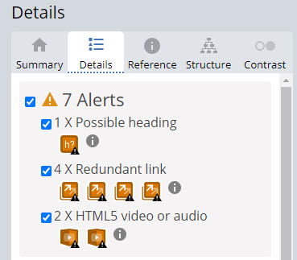
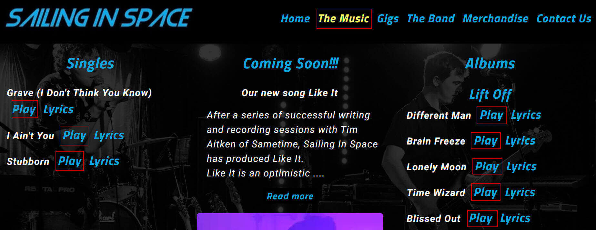
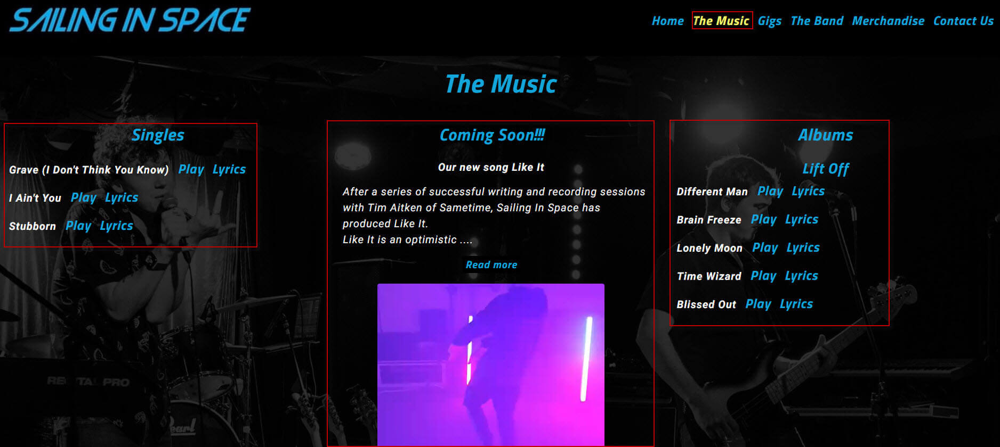

<h1 align="center">Sailing In Space Website - Testing Details</h1>

[View the main README.md document](README.md)

[View the deployed Sailing In Space Website](https://medusas71.github.io/Sailing-In-Space/)

**Please note: To open any links in this document in a new browser tab, press 'CTRL + Click'.**

# Table of Contents

<b>(click to expand or hide)</b>

<!-- MarkdownTOC -->

[Testing](#testing)
* [Validators](#validators)
* [Lighthouse](#lighthouse)
* [Wave Report](#wave)
* [User Stories](#user-stories)

<!-- /MarkdownTOC -->

# Testing 

Testing was conducted manually and through different validator services on each page of the website.

## Validators

* [W3C Markup Validation Service](https://validator.w3.org/#validate_by_input) was used on each page to ensure that there were no errors or warnings in my HTML document and was validated by direct input. I had no errors or warnings on any page:  

* [W3C CSS Validation Service](https://jigsaw.w3.org/css-validator/) was used to ensure that there were no errors or warnings in my CSS document and was validated by direct input. I had no errors or warnings display:

  

* [Autoprefixer CSS Online](https://autoprefixer.github.io/) was used to ensure that all vendor prefixes were included in CSS. The results were copied into the style.css file  

[Back to Table of Contents](#table-of-contents)

## Lighthouse

* [Lighthouse](https://developers.google.com/web/tools/lighthouse) was used to check for any problems on all pages. Some of the issues, like accessibility, I have resolved to improve the score. The remaining issues will be researched to improve the score as I learn.  
Here is the lighthouse score for each page on mobile and desktop:

<b>(click to expand or hide)</b>
  

### index.html - mobile  

### index.html - desktop  

  

### the-music.html - mobile

  

### the-music.html - desktop
  

### gigs.html - mobile

  

### gigs.html - desktop

  

### the-band.html - mobile

  

### the-band.html - desktop

  

### merchandise.html - mobile

 

### merchandise.html - desktop

 

### contact-us.html - mobile

 

### contact-us.html - desktop

 

### thank-you.html - mobile

 

### thank-you.html - desktop

 

 
  
[Back to Table of Contents](#table-of-contents)

## Wave Report  

* [Wave](https://wave.webaim.org/) was used to check for any accessibility issues on all pages. The report came back with no errors and no contrast errors. There were alerts that displayed. I have addressed each alert below:
  

<b>(click to expand or hide)</b>
  

### index.html

5 Alerts display:  
* 1 x Suspicious alternative text - This text is explaining what the image is.
* 1 x Missing first level heading - There is no level 1 heading on this page as it is not required.
* 1 x Possible heading - The See more upcoming events is a paragraph and not a heading.
* 2 x Redundant link - 1 link is for the Home page which the logo also has a link to the Home page. The reason this was done was due to feedback that the user did not know how to return home when on another page. The other link is for the new song "Like It", this link is used twice on the page, once on the words and once on the image.

### the-music.html

5 Alerts display:
* 2 x Skipped heading level - I cannot locate where the heading level is skipped.
* 1 x Possible heading - The words "Our new song Like It" is a paragraph and not a heading.
* 1 x Redundant link - Link is for the Home page which the logo also has a link to the Home page. The reason this was done was due to feedback that the user did not know how to return home when on another page.
* 1 x HTML5 video or audio - This is due to having a snippet of the bands new song on the page. There is no text format available.

### gigs.html

7 Alerts display:
* 1 x Possible heading - The time on the 2nd event is a paragraph and not a heading.
* 4 x Redundant links:
    * The 1st redundant link is for the Home page which the logo also has a link to the Home page. The reason this was done was due to feedback that the user did not know how to return home when on another page.
    * The "Book Us Now" link is on the page twice. The reason for this is if the user wanted to book the band they can do this near the top of the page. The 2nd "Book Us Now" link is at the bottom of the page, in case the user wanted to read the content first and then possibly book the band.
    * The 3rd redundant link is for the 1st event. The same link is on the words "Facebook" and also on the image. 
    * The 4th redundant link is for the 2nd event. The same link is on the words "Facebook" and also on the image. 
* 2 x HTML5 video or audio - There are 2 wedding videos on this page and the band is singing and that is why there is no text format available.

### the-band.html

3 Alerts display:
* 1 x Skipped heading level - No headings were skipped.
* 1 x Possible heading -the text of the individual band member and their role is a paragraph and not a heading.
* 1 x Redundant link - The link is for the Home page which the logo also has a link to the Home page. The reason this was done was due to feedback that the user did not know how to return home when on another page.

### merchandise.html

2 Alerts display:
* 2 x Redundant links - 1 link is for the Home page which the logo also has a link to the Home page. The reason this was done was due to feedback that the user did not know how to return home when on another page. The other link is for the "Contact Us" link, this link is used twice on the page, once on the words and once on the navbar.

### contact-us.html

1 Alert displays:
* 1 x Redundant link - Link is for the Home page which the logo also has a link to the Home page. The reason this was done was due to feedback that the user did not know how to return home when on another page.

### thank-you.html

  
  

   
  
[Back to Table of Contents](#table-of-contents)

## User Stories  

### Testing User Stories from the UX section of [the main README.md document](README.md)  

<b>(click to expand or hide)</b>
  

### Fan Goals

1.  As a fan and a record company, I would like to listen to the bands songs:
    * This is achieved by clicking "The Music" navigation link at the top of each page in the fixed header. Once on "The Music" page, you can click the "Play" button next to each song. The song displays using Spotify in a new tab and it is up to the user to click play on the song. The users can also hear a snippet of the bands new upcoming single on "The Music" page.
    
&nbsp;

  
    

2.  As a fan, I would like to learn about the bands history and the band members:
    * This is achieved by clicking "The Band" navigation link at the top of each page in the fixed header and the "About" navigation link in the fixed footer on every page. A snippet of information regarding the band is displayed on "the Band" page and there is a link to read more about the band. There is also a link against each band member that displays a modal with their bio included.
    
&nbsp;

3.  As a fan, I would like to follow the band on social media:
    * This is achieved by clicking the social media links that are in the fixed footer on every page.
    
&nbsp;
 

4.  As a fan, I would like to see the band at an upcoming gig:
    * This is achieved by viewing the "Upcoming Events" on the "Home Page - index.html" and clicking the "See more upcoming events" link. The user is taken to the "Gigs" page where they can see what events are upcoming.
    * This is also achieved by clicking the "Gigs" navigation link at the top of each page in the fixed header and viewing all upcoming events.
    
&nbsp;

5.  As a fan, I would like the opportunity to book the band for a show:
    * This is achieved by clicking the "Contact Us" link in the fixed header and footer of every page and requesting a booking.
    * You can also click the "Book Us Now" link on the "Gigs" page that forwards you to the "Contact Us" page. 
    
&nbsp;
  

6.  As a fan, I would like to read the lyrics whilst listening to their songs:
    * This is achieved by clicking "The Music" navigation link in the fixed header at the top of every page. On the page you can click "Play" next to a song and Spotify opens in a new tab. You can press play and then go back to the website and click "Lyrics" next to the song. The lyrics display in a modal.
    
&nbsp;
  

7.  As a fan, I would like to view and possibly purchase the bands merchandise:
    * The merchandise can be viewed by clicking the "Merchandise" navigation link at the top of each page in the fixed header. The merchandise can be purchased by using the "Contact Us" form.
    
&nbsp;
  

8.  As a fan, I would like to see the site on all devices such as phone, tablet, laptop and desktop:
    * This is achieved by making the website responsive for all devices.
    
&nbsp;
  

### Site Owner Goals

9.  As a band member of Sailing In Space, I would like to get more gigs:
    * This is achieved by:
        * displaying upcoming events on the "Home" page to promote what they are currently doing;
        * a link on the home page to "See more upcoming events" to promote what they are currently doing;
        * displaying upcoming events on the "Gigs" page to promote what they are currently doing;
        * displaying videos of the band performing on the "Gigs" page to promote what they have done previously;
        * having a contact form on the "Contact Us" page.
    
&nbsp;
  

10. As a band member of Sailing In Space, I would like the opportunity for fans to purchase tickets to upcoming gigs:
    * The upcoming events displayed on the "Home" and "Gigs" page have links to the event where tickets can be purchased directly from the event via Facebook.
    
&nbsp;
  

11. As a band member of Sailing In Space, I would like to sell merchandise:
    * This is achieved by viewing all merchandise on "The Band" page and by using the contact form on the "Contact Us" page to purchase the merchandise.
    
&nbsp;
  

12. As a band member of Sailing In Space, I would like to increase our social media following:
    * This is achieved by having all social media links displayed on the fixed footer that is on each page.
    
&nbsp;
  

13. As a band member of Sailing In Space, I would like to receive a record deal:
    * This can potentially be achieved by promoting their music on "The Music" page and their gigs on "The Band" page.
    * Also, it is noted on the "Band" page that the band is looking for a record deal.
    
&nbsp;
  

### Record Company Goals

14. As a record company, I would like to find out if they already have signed a record deal:
    * The information on "The Band" page advises that the band is looking for a record deal.
    
&nbsp;

15. As a record company, I would like to contact the band:
    * This is achieved by having a contact form on the "Contact Us" page.

 
  
[Back to Table of Contents](#table-of-contents)

## Manual testing of all elements and functionality on every page

### Browsers tested:
*   Google Chrome
*   Mozilla Firefox
*   Microsoft EDGE
*   Opera
*   Safari

### Devices tested:
*   iPhone 12
*   iPhone 11
*   iPhone 8 Plus
*   laptop
*   desktop 

<b>(click to expand or hide)</b>
  

|Page   | Section | Action | Expected Behaviour | Result |
| ----- | ------- | ------ | ------------------ | ------ |
| Home Page | Tab at top of page | On a desktop, go to https://medusas71.github.io/Sailing-In-Space | The Home Page displays; The favicon displays in the tab; the tab is named "Home Sailing In Space" | Pass |
|       | Background | The background is black | The background is black | Pass |
|       | Header  | Scroll to ensure the header is fixed | The header is fixed | Pass |
|       | Logo    | Confirm the logo displays | The logo displays in the top left corner | Pass |
|       |         | Click the logo | The Home Page displays | Pass |
|       | Navigation Bar | Confirm the Home link is yellow | Home link is yellow | Pass |
|       |         | Confirm 6 navigation links display, which include: Home, The Music, Gigs, The Band, Merchandise, Contact Us | The 6 navigation links display | Pass |
|       |         | Hover over the 6 navigation links stated above | All links, except Home, change colour to yellow and all links are underlined once hovered | Pass |
|       |         | Click each navigation link | The correct corresponding page displays and the navigation link stays yellow to state you are on that particular page | Pass |
|       | Main    | Confirm the hero image of Jesse displays on the left of the screen | An image of Jesse displays on the left of the screen | Pass |
|       |         | A blurb about Sailing In Space displays | Blurb displays, top, middle of screen | Pass |
|       |         | The "New Song Coming Soon" heading displays | The heading displays in the middle of the screen | Pass |
|       |         | Hover over the words "Like It" | The text turns yellow and is underlined on hover | Pass |
|       |         | Click the words "Like It" | "The Music" page displays | Pass |
|       |         | Click the "Like It image" | "The Music" page displays | Pass |
|       |         | A hero image of Dylan displays on the right of the screen | An image of Dylan displays on the right of the screen | Pass |
|       |         | Under the "Like It image" there is an upcoming event | There is a title called "Upcoming Events"; there is a date of the event; there is an image of the event; there is a link regarding "see more upcoming events" | Pass |
|       |         | Click the "Upcoming event image" | The upcoming event page displays in Facebook | Pass |
|       |         | Click the link see "more upcoming events" | The "Gigs" page displays | Pass | 
|       | Footer  | Scroll to ensure the footer is fixed | The footer is fixed | Pass |
|       |         | Confirm there are two links on the left hand side | There are two links named "About" and "Contact Us" | Pass |
|       |         | Hover over the two links stated above | Both links change colour to yellow and are underlined once hovered | Pass | 
|       |         | Click the "About" link | "The Band" page displays | Pass |
|       |         | Click the "Contact Us" link |The "Contact Us" page displays | Pass |
|       |         | Confirm the "copyright" information and the "developed by" information display in the middle of the footer | Copyright and developed by information displays in the middle of the footer | Pass |
|       |         | Confirm there are 6 icons in the bottom right of the footer, which includes: Facebook, Instagram, YouTube, Spotify, Apple Music, SoundCloud | The correct 6 icons display | Pass |
|       |         | Hover over the 6 icons stated above | All icons change colour to yellow once hovered | Pass |
|       |         | Click each icon | The correct corresponding page displays in a new tab | Pass |
|       | Responsiveness | Go to Dev Tools and confirm the page displays correctly when you reduce and expand the margins | The correct page displays | Pass | 
|       |         | Change the pixels to 991px | The hamburger menu displays | Pass | 
|       |         | Click the hamburger menu | 6 navigation links display and Home is in yellow | Pass | 
|       |         | Change the pixels to 767px | The page displays vertically; the SIS Bio reduces in text; the 2 separate images come together to make one image; underneath is the "New Song Coming Soon" text and image; and lastly the Upcoming Events display and the footer is placed into 3 rows vertically | Pass |
|       |         | As you scroll down the page on any size, the header and footer are fixed | Header and Footer are fixed | Pass |
| The Music Page | Tab at top of page | On a desktop, go to https://medusas71.github.io/Sailing-In-Space/the-music.html | The Music Page displays; The favicon displays in the tab; the tab is named "Music Sailing In Space" | Pass | 
|       | Background | The background is an opaque image of the boys performing | The background is an opaque image of the boys performing | Pass | 
|       | Header  | Scroll to ensure the header is fixed | The header is fixed | Pass |
|       | Logo    | Confirm the logo displays | The logo displays in the top left corner | Pass | 
|       |         | Click the logo | The Home Page displays | Pass |
|       | Navigation Bar | Confirm the Music link is yellow | Music link is yellow | Pass |
|       |         | Confirm 6 navigation links display, which include: Home, The Music, Gigs, The Band, Merchandise, Contact Us | The 6 navigation links display | Pass |
|       |         | Hover over the 6 navigation links stated above | All links, except Music, change colour to yellow and all links are underlined once hovered | Pass |
|       |         | Click each navigation link | The correct corresponding page displays and the navigation link stays yellow to state you are on that particular page | Pass |
|       | Main    | The title "The Music" displays | The Music title displays in the top, middle of the screen | Pass | 
|       |         | 3 columns display underneath the title | Singles, Coming Soon and Albums | Pass | 
|       |         | Against each song in the Singles and Albums the words "Play" and "Lyrics" display | Play and Lyrics display | Pass | 
|       |         | Hover over the words "Play" and "Lyrics" | The words change colour to yellow and all links are underlined once hovered | Pass |
|       |         | Click "Play" | The song displays on Spotify in a new tab, where the user can select to press play and hear the song | Pass |
|       |         | Click "Lyrics" | A modal displays the lyrics | Pass |
|       |         | On each modal, you can either click the close button or click elsewhere on the screen for the modal to close | The modal closes when clicking the close button or clicking elsewhere on the screen | Pass | 
|       |         | The Coming Soon information displays | Information regarding the new song displays in the middle of the screen | Pass | 
|       |         | A "Read more" button displays underneath part of the text | The button displays | Pass | 
|       |         | Hover over "Read more" button | The button text turns yellow on hover | Pass |
|       |         | Click "Read more" | The rest of the text displays and the button changes from "Read more" to "Read less" | Pass | 
|       |         | Hover over "Read less" button | The button text turns yellow on hover | Pass |
|       |         | Click "Read less" | The overflow of text disappears and the button changes from "Read less" to "Read more" | Pass | 
|       |         | Under the button the Like It video displays | The video does not auto play and you can see the image of the video | Pass |
|       |         | Click play then pause | Video plays, video pauses | Pass | 
|       |         | Click the sound button | Video mutes | Pass | 
|       |         | There is an option to open in full screen and to close the full screen once opened | The video opens in full screen and full screen can be closed | Pass | 
|       | Footer  | Scroll to ensure the footer is fixed | The footer is fixed | Pass |
|       |         | Confirm there are two links on the left hand side | There are two links named "About" and "Contact Us" | Pass |
|       |         | Hover over the two links stated above | Both links change colour to yellow and are underlined once hovered | Pass | 
|       |         | Click the "About" link | "The Band" page displays | Pass |
|       |         | Click the "Contact Us" link | The "Contact Us" page displays | Pass |
|       |         | Confirm the "copyright" information and the "developed by" information display in the middle of the footer | Copyright and developed by information displays in the middle of the footer | Pass |
|       |         | Confirm there are 6 icons in the bottom right of the footer, which include: Facebook, Instagram, YouTube, Spotify, Apple Music, SoundCloud | The correct 6 icons display | Pass |
|       |         | Hover over the 6 icons stated above | All icons change colour to yellow once hovered | Pass |
|       |         | Click each icon | The correct corresponding page displays in a new tab | Pass |
|       | Responsiveness | Go to Dev Tools and confirm the page displays correctly when you reduce and expand the margins | The correct page displays | Pass | 
|       |         | Change the pixels to 991px | The hamburger menu displays | Pass | 
|       |         | Click the hamburger menu | 6 navigation links display and The Music is in yellow | Pass | 
|       |         | Change the pixels to 767px | The background image does not display and the background is black; the page displays vertically; the "New Song Coming Soon" text displays first with a "Read more" button which is clickable; once clicked the rest of the text and a "Read less" button displays; the video displays under the button; the Singles display next and the Albums display last and the footer is placed into 3 rows vertically | Pass |
|       |         | As you scroll down the page on any size, the header and footer are fixed | Header and Footer are fixed | Pass |
| The Gigs Page | Tab at top of page | On a desktop, go to https://medusas71.github.io/Sailing-In-Space/gigs.html | The Gigs Page displays; The favicon displays in the tab; the tab is named "Gigs Sailing In Space" | Pass | 
|       | Background | The background is an opaque image of the boys performing | The background is an opaque image of the boys performing | Pass |
|       | Header  | Scroll to ensure the header is fixed | The header is fixed | Pass |
|       | Logo    | Confirm the logo displays | The logo displays in the top left corner | Pass |
|       |         | Click the logo | The Home Page displays | Pass |
|       | Navigation Bar | Confirm the Gigs link is yellow | Gigs link is yellow | Pass | 
|       |         | Confirm 6 navigation links display, which include: Home, The Music, Gigs, The Band, Merchandise, Contact Us | The 6 navigation links display | Pass |  
|       |         | Hover over the 6 navigation links stated above | All links, except Gigs change colour to yellow and all links are underlined once hovered | Pass |
|       |         | Click each navigation link | The correct corresponding page displays and the navigation link stays yellow to state you are on that particular page | Pass |
|       | Main    | The title "Gigs" displays | The Gigs title displays in the top, middle of the screen | Pass | 
|       |         | Under the title, there is another title named "Book Us Now" | 'Book Us Now" title displays and when hovered over the colour changes to yellow and the link is underlined | Pass |
|       |         | Click the "Book Us Now" link | The "Contact Us" page displays | Pass | 
|       |         | The title "Upcoming Events" displays under "Book Us Now" | The title "Upcoming Events" displays | Pass |
|       |         | 2 columns display underneath the titles | two upcoming events display with date, venue, time, information and image of event | Pass | 
|       |         | The word "Facebook", on both events, is in blue and changes colour when you hover over the word | The word "Facebook" changes from blue to yellow when hovered over | Pass | 
|       |         | When you click either the "Facebook" link or the upcoming event image, on both events, a new tab displays the event via Facebook | A new tab displays the event via Facebook | Pass |
|       |         | On the next line there is a Private Functions and Venue Bookings heading display with a blurb about booking the band | The title of Private Functions and Venue Bookings display with a blurb underneath | Pass | 
|       |         | A "Read more" button displays underneath part of the text | The button displays | Pass | 
|       |         | Hover over "Read more" button | The button text turns yellow on hover | Pass | 
|       |         | Click "Read more" | The rest of the text displays and the button changes from "Read more" to "Read less" | Pass |
|       |         | Hover over "Read less" button | The button text turns yellow on hover | Pass | 
|       |         | Click "Read less" | The overflow of text disappears and the button changes from "Read less" to "Read more" | Pass | 
|       |         | Under the button two wedding videos display | Two wedding videos display, they do not auto play and you can see the image of the video | Pass |
|       |         | Click "Play" then "Pause" | Video plays, video pauses | Pass | 
|       |         | Click the "sound" button | Video mutes | Pass | 
|       |         | There is an option to open in full screen and to close the full screen once opened | the video opens in full screen and full screen can be closed | Pass | 
|       |         | At the bottom of the page there is a title named "Book Us Now" | "Book Us Now" title displays and when hovered over the colour changes to yellow and the link is underlined | Pass | 
|       |         | Click the "Book Us Now" link | The "Contact Us" page displays | Pass |
|       | Footer  | Scroll to ensure the footer is fixed | The footer is fixed | Pass | 
|       |         | Confirm there are two links on the left hand side | There are two links named "About" and "Contact Us" | Pass |
|       |         | Hover over the two links stated above | Both links change colour to yellow and are underlined once hovered | Pass |
|       |         | Click the "About" link | "The Band" page displays | Pass |
|       |         | Click the "Contact Us" link | The "Contact Us" page displays | Pass | 
|       |         | Confirm the "copyright" information and the "developed by" information displays in the middle of the footer | Copyright and developed by information displays in the middle of the footer | Pass |
|       |         | Confirm there are 6 icons in the bottom right of the footer, which includes Facebook, Instagram, YouTube, Spotify, Apple Music, SoundCloud | The correct 6 icons display | Pass |
|       |         | Hover over the 6 icons stated above | All icons change colour to yellow once hovered | Pass | 
|       |         | Click each icon | The correct corresponding page displays in a new tab | Pass | 
|       | Responsiveness | Go to Dev Tools and confirm the page displays correctly when you reduce and expand the margins | The correct page displays | Pass | 
|       |         | Change the pixels to 991px | The hamburger menu displays | Pass | 
|       |         | Click the hamburger menu | 6 navigation links display and Gigs is in yellow | Pass | 
|       |         | Change the pixels to 767px | The background image does not display and the background is black; the page displays vertically; The titles "Gigs" "Book Us Now" and "Upcoming Events" display in that order; The 1st event displays; The 2nd event displays; the "Private Functions and Venue Bookings" title displays; There is a "Read more" button under the text which is clickable; once clicked the rest of the text and a "Read less" button displays; the two videos display underneath and another "Book Us Now" link displays last and the footer is placed into 3 rows vertically | Pass | 
|       |         | As you scroll down the page on any size, the header and footer are fixed | Header and Footer are fixed | Pass | 
| The Band Page | Tab at top of page | On a desktop, go to https://medusas71.github.io/Sailing-In-Space/the-band.html | The Band Page displays; The favicon displays in the tab; the tab is named "The Band Sailing In Space" | Pass | 
|       | Background | The background is an image of the boys sitting down | The background is an image of the boys sitting down facing each other | Pass | 
|       | Header  | Scroll to ensure the header is fixed | The header is fixed | Pass |
|       | Logo    | Confirm the logo displays | The logo displays in the top left corner| Pass |
|       |         | Click the logo | The Home Page displays | Pass | 
|       | Navigation Bar | Confirm The Band link is yellow | The Band link is yellow | Pass | 
|       |         | Confirm 6 navigation links display, which include: Home, The Music, Gigs, The Band, Merchandise, Contact Us | The 6 navigation links display | Pass | 
|       |         | Hover over the 6 navigation links stated above | All links except The Band change colour to yellow and all links are underlined once hovered | Pass | 
|       |         | Click each navigation link | The correct corresponding page displays and the navigation link stays yellow to state you are on that particular page | Pass | 
|       | Main | The title "The Band" displays | The title "The Band" displays in the top, middle of the screen | Pass |
|       |         | Under the title part of a spiel displays | Part of a spiel displays in the middle of the screen of how the band formed | Pass |  
|       |         | A "Read more" button displays underneath part of the text | The button displays | Pass | 
|       |         | Hover over "Read more" button | The button text turns yellow on hover | Pass |  
|       |         | Click "Read more" | The rest of the text displays and the button changes from "Read more" to "Read Less" | Pass | 
|       |         | Hover over "Read less" button | The button text turns yellow on hover | Pass | 
|       |         | Click "Read less" | The overflow of text disappears and the button changes from "Read less" to "Read more" | Pass | 
|       |         | Under the button to the left of the screen is Jesse's title and a link to his bio | Jesse's title and bio display and when hovered over the bio, the colour changes to yellow and the link is underlined | Pass | 
|       |         | Click the "Jesse Bio" link | A modal displays Jesse's bio | Pass | 
|       |         | On the modal, you can either click the close button or click elsewhere on the screen for the modal to close | The modal closes when clicking the close button or clicking elsewhere on the screen | Pass |
|       |         | Under the button to the right of the screen is Dylan's title and a link to his bio | Dylan's title and bio display and when hovered over the bio, the colour changes to yellow and the link is underlined | Pass | 
|       |         | Click the "Dylan Bio" link | A modal displays Dylan's bio | Pass | 
|       |         | On the modal, you can either click the close button or click elsewhere on the screen for the modal to close | The modal closes when clicking the close button or clicking elsewhere on the screen | Pass |
|       | Footer  | Scroll to ensure the footer is fixed | The footer is fixed | Pass |
|       |         | Confirm there are two links on the left hand side | There are two links named "About" and "Contact Us" | Pass | 
|       |         | Hover over the two links stated above | Both links change colour to yellow and are underlined once hovered | Pass | 
|       |         | Click the "About" link | "The Band" page displays | Pass | 
|       |         | Click the "Contact Us" link | The "Contact Us" page displays | Pass | 
|       |         | Confirm the "copyright" information and the "developed by" information displays in the middle of the footer | Copyright and developed by information displays in the middle of the footer | Pass | 
|       |         | Confirm there are 6 icons in the bottom right of the footer, which include: Facebook, Instagram, YouTube, Spotify, Apple Music, SoundCloud | The correct 6 icons display | Pass | 
|       |         | Hover over the 6 icons stated above | All icons change colour to yellow once hovered | Pass | 
|       |         | Click each icon | The correct corresponding page displays in a new tab | Pass | 
|       | Responsiveness | Go to Dev Tools and confirm the page displays correctly when you reduce and expand the margins | The correct page displays | Pass | 
|       |         | Change the pixels to 991px | The hamburger menu displays | Pass | 
|       |         | Click the hamburger menu | 6 navigation links display and The Band is in yellow | Pass | 
|       |         | Change the pixels to 767px | The background image does not display and the background is black; the page displays vertically; The title "The Band" displays; Text regarding how the band formed displays under the title with a "Read more" button which is clickable; once clicked the rest of the text and a "Read less" button displays; Jesse's title displays under the text; a circular image of Jesse's head displays under the title and the "Jesse Bio" link displays; Next Dylan's title displays; a circular image of Dylan's head displays under his title and the "Dylan Bio" link displays; The footer is placed into 3 rows vertically | Pass | 
| The Merchandise Page | Tab at top of page | On a desktop, go to https://medusas71.github.io/Sailing-In-Space/merchandise.html | The Merchandise Page displays; The favicon displays in the tab; the tab is named "Merchandise Sailing In Space" | Pass | 
|       | Background | The background is black | The background is black | Pass | 
|       | Header  | Scroll to ensure the header is fixed | The header is fixed | Pass | 
|       | Logo    | Confirm the logo displays | The logo displays in the top left corner | Pass | 
|       |         | Click the logo | The Home Page displays | Pass |
|       | Navigation Bar | Confirm the Merchandise link is yellow | Merchandise link is yellow | Pass | 
|       |         | Confirm 6 navigation links display, which include: Home, The Music, Gigs, The Band, Merchandise, Contact Us | The 6 links display | Pass |  
|       |         | Hover over the 6 navigation links stated above | All links, except Merchandise change colour to yellow and all links are underlined once hovered | Pass | 
|       |         | Click each navigation link | The correct corresponding page displays and the navigation link stays yellow to state you are on that particular page | Pass | 
|       | Main    | The title "Merchandise" displays | The title "Merchandise" displays in the top, middle of the screen | Pass |  
|       |         | Under the title there is line of text and the words "Contact Us" are displayed in blue and change colour when hovered over | A line of text displays and the words "Contact Us" display in blue and change colour to yellow when hovered over | Pass |
|       |         | Click the words "Contact Us" | The "Contact Us" page displays | Pass | 
|       |         | To the left of the screen a carousel displays with 5 different images with text and prices on each image | 5 different images display in a carousel with text and prices on each image | Pass | 
|       |         | To the right of the screen an image displays of the back of the Sailing In Space shirt worn by Dylan | Image displays of the back of the Sailing In Space shirt worn by Dylan | Pass | 
|       | Footer  | Scroll to ensure the footer is fixed | The footer is fixed | Pass | 
|       |         | Confirm there are two links on the left hand side | There are two links named "About" and "Contact Us" | Pass | 
|       |         | Hover over the two links stated above | Both links change colour to yellow and are underlined once hovered | Pass | 
|       |         | Click the "About" link | "The Band" page displays | Pass | 
|       |         | Click the "Contact Us" link |The "Contact Us" page displays | Pass | 
|       |         | Confirm the "copyright" information and the "developed by" information displays in the middle of the footer | Copyright and developed by information displays in the middle of the footer | Pass | 
|       |         | Confirm there are 6 icons in the bottom right of the footer, which include: Facebook, Instagram, YouTube, Spotify, Apple Music, SoundCloud | The correct 6 icons display | Pass |
|       |         | Hover over the 6 icons stated above | All icons change colour to yellow once hovered | Pass | 
|       |         | Click each icon | The correct corresponding page displays in a new tab | Pass | 
|       | Responsiveness | Go to Dev Tools and confirm the page displays correctly when you reduce and expand the margins | The correct page displays | Pass | 
|       |         | Change the pixels to 991px | The hamburger menu displays | Pass | 
|       |         | Click the hamburger menu | 6 navigation links display and Merchandise is in yellow | Pass | 
|       |         | Change the pixels to 767px | The background image is black; the page displays vertically; the title "Merchandise" displays; a line of text displays under the title with the link "Contact Us" within the text; A carousel displays underneath with 5 different images with text and prices on each image; lastly the image of the back of the Sailing In Space shirt worn by Dylan displays; the footer is placed into 3 rows vertically | Pass | 
|       |         |  As you scroll down the page on any size, the header and footer are fixed | Header and Footer are fixed | Pass | 
| The Contact Us Page | Tab at top of page | On a desktop, go to https://medusas71.github.io/Sailing-In-Space/contact-us.html | The Contact Us Page displays; The favicon displays in the tab; the tab is named "Contact Us Sailing In Space" | Pass | 
|       | Background | The background is black | The background is black | Pass | 
|       | Header | Scroll to ensure the header is fixed | The header is fixed | Pass | 
| | Logo | Confirm the logo displays | The logo displays in the top left corner | Pass | 
|       |         | Click the logo | The Home Page displays | Pass | 
|       | Navigation Bar | Confirm the Contact Us link is yellow | Contact Us link is yellow | Pass | 
|       |         | Confirm 6 navigation links display, which include: Home, The Music, Gigs, The Band, Merchandise, Contact Us | The 6 links display | Pass | 
|       |         | Hover over the 6 navigation links stated above | All links, except Contact Us change colour to yellow and all links are underlined once hovered | Pass | 
|       |         | Click each navigation link | The correct corresponding page displays and the navigation link stays yellow to state you are on that particular page | Pass | 
|       | Main    | The title "Contact Us" displays | The title "Contact Us" displays in the top, middle of the screen | Pass | 
|       |         | To the left of the screen a form displays asking for Name, Email, Phone Number, Subject (with a dropdown menu), an area to type your message and a blue text Submit button that changes colour when hovered over | The words and text boxes display for Name, Email, Phone Number, Subject that has a dropdown menu consisting of Bookings, Merchandise, General Queries and Other, a text box to type your message and the submit button text is in blue and changes colour to yellow when hovered over | Pass |  
|       |         | Click the "Submit" button without entering any text | An error message displays that the field must be filled in | Pass | 
|       |         | Enter an invalid email address without the @ symbol | An error message displays that the @ symbol is missing from the email address | Pass | 
|       |         | Enter all fields except for a phone number | An error message displays that the field must be filled in | Pass | 
|       |         | Click the dropdown menu on Subject and confirm that you can select a different subject | Bookings, Merchandise, General Queries and Other could be selected | Pass | 
|       |         | Enter all fields and click the "Submit" button | A Thank You page displays advising the user that their enquiry has been submitted, that Sailing In Space will get back to the user as soon as possible and to have a wonderful day, with a rocket emoji | Pass | 
|       |         | To the right of the screen an image displays of Sailing In Space | An image of Sailing In Space displays | Pass | 
|       | Footer  | Scroll to ensure the footer is fixed | The footer is fixed | Pass | 
|       |         | Confirm there are two links on the left hand side | There are two links named "About" and "Contact Us" | Pass | 
|       |         | Hover over the two links stated above | Both links change colour to yellow and are underlined once hovered | Pass | 
|       |         | Click the "About" link | "The Band" page displays | Pass | 
|       |         | Click the "Contact Us" link | The "Contact Us" page displays | Pass | 
|       |         | Confirm the "copyright" information and the "developed by" information displays in the middle of the footer | Copyright and developed by information displays in the middle of the footer | Pass | 
|       |         | Confirm there are 6 icons in the bottom right of the footer, which include: Facebook, Instagram, YouTube, Spotify, Apple Music, SoundCloud | The correct 6 icons display | Pass | 
|       |         | Hover over the 6 icons stated above | All icons change colour to yellow once hovered | Pass | 
|       |         | Click each icon | The correct corresponding page displays in a new tab | Pass | 
|       | Responsiveness | Go to Dev Tools and confirm the page displays correctly when you reduce and expand the margins | The correct page displays | Pass | 
|       |         | Change the pixels to 991px | The hamburger menu displays | Pass | 
|       |         | Click the hamburger menu | 6 navigation links display and Contact Us is in yellow | Pass | 
|       |         | Change the pixels to 767px | The background is black; the page displays vertically; the title "Contact Us" displays; The name, email, phone number and text areas, subject (with a dropdown menu) and an area to type your message with a Submit button displays; the footer is placed into 3 rows vertically | Pass | 
|       |         | As you scroll down the page on any size, the header and footer are fixed | Header and Footer are fixed | Pass | 

[Back to Table of Contents](#table-of-contents)

# Bugs/Fixes

**Home Page - index.html**

**1.    Issue**:  
    On the home page, I had issues where the images weren't displaying on top of each other on a mobile view. 
* **Fix**: To rectify this, I made my images responsive and that fixed the issue.  

**2.    Issue**:  
    I initially created the video using the video tag in HTML but found the video was taking over the whole screen and wasn't responsive. I changed the video tag to an iframe and this fixed the problem. However the video was set to autoplay on a desktop, which I didn't want to happen. 
* **Fix**: I reverted back to using the video tag and made it responsive by using height: auto and width: 100%.  

**3.    Issue**:  
    The 2nd event wasn't fully displaying on mobile phones. 
* **Fix**: To rectify this I added some media queries specifically for screens with a max-width of 576px. 

**4.    Issue**:  
    I originally had the background image URL on the music page in the HTML instead of the CSS. I was advised by some of the slack students that it was better if I have the URL in the CSS. I tried to put it in the CSS but I was having lots of issues having the image displayed as I wanted it. I spoke to Tutor Support and they advised that there is nothing wrong with having the URL and a huge negative margin to display the text on top of the image.
* **Fix**: I placed the URL for the background image on the music page back in the HTML and I was able to display the image perfectly.  

**Merchandise Page merchandise.html**

**1.    Issue**: 
    I was interested in adding a carousel to the merchandise page. I copied the code from Bootstrap, however whenever I would click the arrow on the carousel, the carousel would change size and get larger.  
* **Fix**: I found the same question asked on [stack overflow](https://stackoverflow.com/questions/49844515/how-do-i-stop-my-bootstrap-carousel-from-changing-size) and found a resolution to the issue by adding an overflow to the css.  

**2.    Issue**;
    On the carousel the text wouldn't display on the first 2 images, but will display on the 3rd image.  
* **Fix**: I had a look on Slack and found this article by [Des Cahill](https://slack-files.com/T0L30B202-F8BFVUW8K-afa2370dff) that I copied and modified accordingly. I could then view the text on the carousel and was able to move the text position.  

**Contact Us Page contact-us.html**

**1.    Issue**;
    When conducting a [Wave Report](https://wave.webaim.org/) on the page, I was advised that a label was missing on the text area part of the form.  
* **Fix**: I found the same question asked on [stack overflow](https://stackoverflow.com/questions/38142464/web-accessibility-failing-on-missing-form-label) and found a resolution in how to add the missing label to the text area part of the form. I added aria-label in the text area.

[Back to Table of Contents](#table-of-contents)